# PROMPTS

This document outlines the hierarchy of instructions, prompts, and other file resources intended for use by LLMs assigned with some CodeQL development task(s).

## Prompts Hierarchy Description

In order to keep the prompt system organized and efficient, the following hierarchy is established:

### 1. `.github/ISSUE_TEMPLATE/*.md`

- Entry point for Copilot Coding Agent workflows.
- Pre-structured for different query development scenarios.
- Links to relevant instructions and prompts.

### 2. `.github/instructions/*.instructions.md`

- Highest level of abstraction in the prompt hierarchy.
- Sent with every request to the LLM, so must be concise and clear.

### 3. `.github/prompts/*.prompt.md`

- High-level prompts for multi-step CodeQL development tasks.
- Provides summaries of, and links to, lower-level prompts for specific tasks.
- Includes `cli_resources.prompt.md` - comprehensive reference for all CLI tools.
- Includes `test_driven_ql_development.prompt.md` - methodology for test-driven CodeQL query development.

### 4A. `languages/<language>/tools/dev/*.prompt.md`

- Language-specific development resources and AST references.
- Provides detailed information about language AST nodes, security patterns, and framework modeling.
- Includes comprehensive guides for implementing security queries and framework models.

### 4B. `resources/<tool_name>/prompts/*.prompt.md`

- Static, tool-specific resources for guiding the use of specific CLI commands.
- Tells LLMs how and when to make use of the subcommands of the `codeql` and `qlt` CLI tools.

## Prompts Hierarchy Visualization

The following diagram shows the relationships between actual instructions and prompts at each level of the hierarchy.

```mermaid
graph TD;
    %% Level 1: GitHub Issue Templates
    ISSUE_TEMPLATE_QUERY_CREATE[".github/ISSUE_TEMPLATE/query-create.yml"]

    %% Level 2: Language-specific Instructions
    INSTR_ACTIONS[".github/instructions/languages_actions_ql.instructions.md"]
    INSTR_CPP[".github/instructions/languages_cpp_ql.instructions.md"]
    INSTR_CSHARP[".github/instructions/languages_csharp_ql.instructions.md"]
    INSTR_GO[".github/instructions/languages_go_ql.instructions.md"]
    INSTR_JAVA[".github/instructions/languages_java_ql.instructions.md"]
    INSTR_JAVASCRIPT[".github/instructions/languages_javascript_ql.instructions.md"]
    INSTR_PYTHON[".github/instructions/languages_python_ql.instructions.md"]
    INSTR_QL[".github/instructions/languages_ql_ql.instructions.md"]
    INSTR_RUBY[".github/instructions/languages_ruby_ql.instructions.md"]
    INSTR_CLI_PROMPTS[".github/instructions/resources_cli_prompts.instructions.md"]

    %% Level 3: High-level Prompts
    PROMPT_ACTIONS_DEV[".github/prompts/actions_query_development.prompt.md"]
    PROMPT_CLI_RESOURCES[".github/prompts/cli_resources.prompt.md"]
    PROMPT_TEST_DRIVEN_DEV[".github/prompts/test_driven_ql_development.prompt.md"]
    PROMPT_CPP_DEV[".github/prompts/cpp_query_development.prompt.md"]
    PROMPT_CSHARP_DEV[".github/prompts/csharp_query_development.prompt.md"]
    PROMPT_GO_DEV[".github/prompts/go_query_development.prompt.md"]
    PROMPT_JAVA_DEV[".github/prompts/java_query_development.prompt.md"]
    PROMPT_JAVASCRIPT_DEV[".github/prompts/javascript_query_development.prompt.md"]
    PROMPT_PYTHON_DEV[".github/prompts/python_query_development.prompt.md"]
    PROMPT_QL_DEV[".github/prompts/ql_query_development.prompt.md"]
    PROMPT_RUBY_DEV[".github/prompts/ruby_query_development.prompt.md"]
    PROMPT_GIT_HOOKS[".github/prompts/git_hooks.prompt.md"]

    %% Level 4A: Language-specific Development Prompts
    LANG_AST_ACTIONS["languages/actions/tools/dev/actions_ast.prompt.md"]
    LANG_AST_CPP["languages/cpp/tools/dev/cpp_ast.prompt.md"]
    LANG_AST_CSHARP["languages/csharp/tools/dev/csharp_ast.prompt.md"]
    LANG_AST_GO["languages/go/tools/dev/go_ast.prompt.md"]
    LANG_AST_JAVA["languages/java/tools/dev/java_ast.prompt.md"]
    LANG_AST_JAVASCRIPT["languages/javascript/tools/dev/javascript_ast.prompt.md"]
    LANG_AST_PYTHON["languages/python/tools/dev/python_ast.prompt.md"]
    LANG_AST_QL["languages/ql/tools/dev/ql_ast.prompt.md"]
    LANG_AST_RUBY["languages/ruby/tools/dev/ruby_ast.prompt.md"]

    LANG_SEC_ACTIONS["languages/actions/tools/dev/actions_security_query_guide.prompt.md"]
    LANG_SEC_CPP["languages/cpp/tools/dev/cpp_security_query_guide.prompt.md"]
    LANG_SEC_CSHARP["languages/csharp/tools/dev/csharp_security_query_guide.prompt.md"]
    LANG_SEC_GO["languages/go/tools/dev/go_security_query_guide.prompt.md"]
    LANG_PRINTAST_GO["languages/go/tools/dev/go_printast_customization.prompt.md"]
    LANG_SEC_JAVA["languages/java/tools/dev/java_security_query_guide.prompt.md"]
    LANG_SEC_JAVASCRIPT["languages/javascript/tools/dev/javascript_security_query_guide.prompt.md"]
    LANG_SEC_PYTHON["languages/python/tools/dev/python_security_query_guide.prompt.md"]
    LANG_SEC_QL["languages/ql/tools/dev/ql_security_query_guide.prompt.md"]
    LANG_SEC_RUBY["languages/ruby/tools/dev/ruby_security_query_guide.prompt.md"]

    %% Level 4B: CodeQL CLI Tool Prompts
    RES_CLI_CODEQL_BQRS_DECODE["resources/cli/codeql/codeql_bqrs_decode.prompt.md"]
    RES_CLI_CODEQL_BQRS_INFO["resources/cli/codeql/codeql_bqrs_info.prompt.md"]
    RES_CLI_CODEQL_DATABASE_ANALYZE["resources/cli/codeql/codeql_database_analyze.prompt.md"]
    RES_CLI_CODEQL_DATABASE_CREATE["resources/cli/codeql/codeql_database_create.prompt.md"]
    RES_CLI_CODEQL_EXECUTE_QUERY_SERVER2["resources/cli/codeql/codeql_execute_query-server2.prompt.md"]
    RES_CLI_CODEQL_GENERATE_EXTENSIBLE_PREDICATE["resources/cli/codeql/codeql_generate_extensible-predicate-metadata.prompt.md"]
    RES_CLI_CODEQL_GENERATE_LOG_SUMMARY["resources/cli/codeql/codeql_generate_log-summary.prompt.md"]
    RES_CLI_CODEQL_GENERATE_QUERY_HELP["resources/cli/codeql/codeql_generate_query-help.prompt.md"]
    RES_CLI_CODEQL_PACK_INSTALL["resources/cli/codeql/codeql_pack_install.prompt.md"]
    RES_CLI_CODEQL_PACK_LS["resources/cli/codeql/codeql_pack_ls.prompt.md"]
    RES_CLI_CODEQL_QUERY_FORMAT["resources/cli/codeql/codeql_query_format.prompt.md"]
    RES_CLI_CODEQL_QUERY_COMPILE["resources/cli/codeql/codeql_query_compile.prompt.md"]
    RES_CLI_CODEQL_QUERY_RUN["resources/cli/codeql/codeql_query_run.prompt.md"]
    RES_CLI_CODEQL_RESOLVE_LANGUAGES["resources/cli/codeql/codeql_resolve_languages.prompt.md"]
    RES_CLI_CODEQL_RESOLVE_LIBRARY_PATH["resources/cli/codeql/codeql_resolve_library-path.prompt.md"]
    RES_CLI_CODEQL_RESOLVE_METADATA["resources/cli/codeql/codeql_resolve_metadata.prompt.md"]
    RES_CLI_CODEQL_RESOLVE_QUERIES["resources/cli/codeql/codeql_resolve_queries.prompt.md"]
    RES_CLI_CODEQL_RESOLVE_TEST["resources/cli/codeql/codeql_resolve_test.prompt.md"]
    RES_CLI_CODEQL_RESOLVE_DATABASE["resources/cli/codeql/codeql_resolve_database.prompt.md"]
    RES_CLI_CODEQL_RESOLVE_EXTRACTOR["resources/cli/codeql/codeql_resolve_extractor.prompt.md"]
    RES_CLI_CODEQL_TEST_ACCEPT["resources/cli/codeql/codeql_test_accept.prompt.md"]
    RES_CLI_CODEQL_TEST_RUN["resources/cli/codeql/codeql_test_run.prompt.md"]
    RES_CLI_CODEQL_TEST_EXTRACT["resources/cli/codeql/codeql_test_extract.prompt.md"]

    %% Level 4B: QLT CLI Tool Prompts
    RES_CLI_QLT_QUERY_RUN_INSTALL_PACKS["resources/cli/qlt/qlt_query_run_install-packs.prompt.md"]
    RES_CLI_QLT_QUERY_GENERATE_NEW["resources/cli/qlt/qlt_query_generate_new-query.prompt.md"]
    RES_CLI_QLT_TEST_RUN_EXECUTE["resources/cli/qlt/qlt_test_run_execute-unit-tests.prompt.md"]
    RES_CLI_QLT_TEST_RUN_VALIDATE["resources/cli/qlt/qlt_test_run_validate-unit-tests.prompt.md"]

    %% Level 1 to Level 2 connections (target-language driven)
    ISSUE_TEMPLATE_QUERY_CREATE --> INSTR_ACTIONS
    ISSUE_TEMPLATE_QUERY_CREATE --> INSTR_CPP
    ISSUE_TEMPLATE_QUERY_CREATE --> INSTR_CSHARP
    ISSUE_TEMPLATE_QUERY_CREATE --> INSTR_GO
    ISSUE_TEMPLATE_QUERY_CREATE --> INSTR_JAVA
    ISSUE_TEMPLATE_QUERY_CREATE --> INSTR_JAVASCRIPT
    ISSUE_TEMPLATE_QUERY_CREATE --> INSTR_PYTHON
    ISSUE_TEMPLATE_QUERY_CREATE --> INSTR_QL
    ISSUE_TEMPLATE_QUERY_CREATE --> INSTR_RUBY
    ISSUE_TEMPLATE_QUERY_CREATE --> INSTR_CLI_PROMPTS

    %% Level 1 to Level 3 connections (CLI resources)
    ISSUE_TEMPLATE_QUERY_CREATE --> PROMPT_CLI_RESOURCES
    ISSUE_TEMPLATE_QUERY_CREATE --> PROMPT_TEST_DRIVEN_DEV

    %% Level 2 to Level 3 connections (language-specific)
    INSTR_ACTIONS --> PROMPT_ACTIONS_DEV
    INSTR_CPP --> PROMPT_CPP_DEV
    INSTR_CSHARP --> PROMPT_CSHARP_DEV
    INSTR_GO --> PROMPT_GO_DEV
    INSTR_JAVA --> PROMPT_JAVA_DEV
    INSTR_JAVASCRIPT --> PROMPT_JAVASCRIPT_DEV
    INSTR_PYTHON --> PROMPT_PYTHON_DEV
    INSTR_QL --> PROMPT_QL_DEV
    INSTR_RUBY --> PROMPT_RUBY_DEV

    %% Level 2 to Level 3 connections (shared resources)
    INSTR_ACTIONS --> PROMPT_CLI_RESOURCES
    INSTR_ACTIONS --> PROMPT_TEST_DRIVEN_DEV
    INSTR_ACTIONS --> PROMPT_GIT_HOOKS
    INSTR_CPP --> PROMPT_CLI_RESOURCES
    INSTR_CPP --> PROMPT_TEST_DRIVEN_DEV
    INSTR_CPP --> PROMPT_GIT_HOOKS
    INSTR_CSHARP --> PROMPT_CLI_RESOURCES
    INSTR_CSHARP --> PROMPT_TEST_DRIVEN_DEV
    INSTR_CSHARP --> PROMPT_GIT_HOOKS
    INSTR_GO --> PROMPT_CLI_RESOURCES
    INSTR_GO --> PROMPT_TEST_DRIVEN_DEV
    INSTR_GO --> PROMPT_GIT_HOOKS
    INSTR_JAVA --> PROMPT_CLI_RESOURCES
    INSTR_JAVA --> PROMPT_TEST_DRIVEN_DEV
    INSTR_JAVA --> PROMPT_GIT_HOOKS
    INSTR_JAVASCRIPT --> PROMPT_CLI_RESOURCES
    INSTR_JAVASCRIPT --> PROMPT_TEST_DRIVEN_DEV
    INSTR_JAVASCRIPT --> PROMPT_GIT_HOOKS
    INSTR_PYTHON --> PROMPT_CLI_RESOURCES
    INSTR_PYTHON --> PROMPT_TEST_DRIVEN_DEV
    INSTR_PYTHON --> PROMPT_GIT_HOOKS
    INSTR_QL --> PROMPT_CLI_RESOURCES
    INSTR_QL --> PROMPT_TEST_DRIVEN_DEV
    INSTR_QL --> PROMPT_GIT_HOOKS
    INSTR_RUBY --> PROMPT_CLI_RESOURCES
    INSTR_RUBY --> PROMPT_TEST_DRIVEN_DEV
    INSTR_RUBY --> PROMPT_GIT_HOOKS
    INSTR_CLI_PROMPTS --> PROMPT_CLI_RESOURCES
    INSTR_CLI_PROMPTS --> PROMPT_GIT_HOOKS

    %% Level 3 to Level 4 connections (tool references)
    PROMPT_ACTIONS_DEV --> RES_CLI_CODEQL_QUERY_FORMAT
    PROMPT_ACTIONS_DEV --> RES_CLI_CODEQL_QUERY_COMPILE
    PROMPT_ACTIONS_DEV --> RES_CLI_CODEQL_QUERY_RUN
    PROMPT_ACTIONS_DEV --> RES_CLI_CODEQL_EXECUTE_QUERY_SERVER2
    PROMPT_ACTIONS_DEV --> RES_CLI_QLT_QUERY_RUN_INSTALL_PACKS
    PROMPT_ACTIONS_DEV --> RES_CLI_QLT_QUERY_GENERATE_NEW

    PROMPT_CPP_DEV --> RES_CLI_CODEQL_QUERY_FORMAT
    PROMPT_CPP_DEV --> RES_CLI_CODEQL_QUERY_COMPILE
    PROMPT_CPP_DEV --> RES_CLI_CODEQL_QUERY_RUN
    PROMPT_CPP_DEV --> RES_CLI_CODEQL_EXECUTE_QUERY_SERVER2
    PROMPT_CPP_DEV --> RES_CLI_CODEQL_DATABASE_CREATE
    PROMPT_CPP_DEV --> RES_CLI_CODEQL_TEST_RUN

    PROMPT_CSHARP_DEV --> RES_CLI_CODEQL_QUERY_FORMAT
    PROMPT_CSHARP_DEV --> RES_CLI_CODEQL_QUERY_COMPILE
    PROMPT_CSHARP_DEV --> RES_CLI_CODEQL_QUERY_RUN
    PROMPT_CSHARP_DEV --> RES_CLI_CODEQL_EXECUTE_QUERY_SERVER2
    PROMPT_CSHARP_DEV --> RES_CLI_CODEQL_DATABASE_ANALYZE
    PROMPT_CSHARP_DEV --> RES_CLI_CODEQL_DATABASE_CREATE

    PROMPT_GO_DEV --> RES_CLI_CODEQL_QUERY_FORMAT
    PROMPT_GO_DEV --> RES_CLI_CODEQL_QUERY_COMPILE
    PROMPT_GO_DEV --> RES_CLI_CODEQL_QUERY_RUN
    PROMPT_GO_DEV --> RES_CLI_CODEQL_EXECUTE_QUERY_SERVER2
    PROMPT_GO_DEV --> RES_CLI_CODEQL_DATABASE_CREATE
    PROMPT_GO_DEV --> RES_CLI_CODEQL_TEST_RUN

    PROMPT_JAVA_DEV --> RES_CLI_CODEQL_QUERY_FORMAT
    PROMPT_JAVA_DEV --> RES_CLI_CODEQL_QUERY_COMPILE
    PROMPT_JAVA_DEV --> RES_CLI_CODEQL_QUERY_RUN
    PROMPT_JAVA_DEV --> RES_CLI_CODEQL_EXECUTE_QUERY_SERVER2
    PROMPT_JAVA_DEV --> RES_CLI_CODEQL_DATABASE_ANALYZE
    PROMPT_JAVA_DEV --> RES_CLI_CODEQL_DATABASE_CREATE
    PROMPT_JAVA_DEV --> RES_CLI_CODEQL_TEST_RUN

    PROMPT_JAVASCRIPT_DEV --> RES_CLI_CODEQL_QUERY_FORMAT
    PROMPT_JAVASCRIPT_DEV --> RES_CLI_CODEQL_QUERY_COMPILE
    PROMPT_JAVASCRIPT_DEV --> RES_CLI_CODEQL_QUERY_RUN
    PROMPT_JAVASCRIPT_DEV --> RES_CLI_CODEQL_EXECUTE_QUERY_SERVER2
    PROMPT_JAVASCRIPT_DEV --> RES_CLI_CODEQL_DATABASE_ANALYZE
    PROMPT_JAVASCRIPT_DEV --> RES_CLI_CODEQL_DATABASE_CREATE
    PROMPT_JAVASCRIPT_DEV --> RES_CLI_CODEQL_TEST_RUN

    PROMPT_PYTHON_DEV --> RES_CLI_CODEQL_QUERY_FORMAT
    PROMPT_PYTHON_DEV --> RES_CLI_CODEQL_QUERY_COMPILE
    PROMPT_PYTHON_DEV --> RES_CLI_CODEQL_QUERY_RUN
    PROMPT_PYTHON_DEV --> RES_CLI_CODEQL_EXECUTE_QUERY_SERVER2
    PROMPT_PYTHON_DEV --> RES_CLI_CODEQL_DATABASE_ANALYZE
    PROMPT_PYTHON_DEV --> RES_CLI_CODEQL_DATABASE_CREATE
    PROMPT_PYTHON_DEV --> RES_CLI_CODEQL_TEST_RUN

    PROMPT_QL_DEV --> RES_CLI_CODEQL_QUERY_FORMAT
    PROMPT_QL_DEV --> RES_CLI_CODEQL_QUERY_COMPILE
    PROMPT_QL_DEV --> RES_CLI_CODEQL_QUERY_RUN
    PROMPT_QL_DEV --> RES_CLI_CODEQL_EXECUTE_QUERY_SERVER2
    PROMPT_QL_DEV --> RES_CLI_CODEQL_RESOLVE_LANGUAGES
    PROMPT_QL_DEV --> RES_CLI_CODEQL_RESOLVE_LIBRARY_PATH
    PROMPT_QL_DEV --> RES_CLI_CODEQL_RESOLVE_METADATA

    PROMPT_RUBY_DEV --> RES_CLI_CODEQL_QUERY_FORMAT
    PROMPT_RUBY_DEV --> RES_CLI_CODEQL_QUERY_COMPILE
    PROMPT_RUBY_DEV --> RES_CLI_CODEQL_QUERY_RUN
    PROMPT_RUBY_DEV --> RES_CLI_CODEQL_EXECUTE_QUERY_SERVER2
    PROMPT_RUBY_DEV --> RES_CLI_CODEQL_DATABASE_CREATE
    PROMPT_RUBY_DEV --> RES_CLI_CODEQL_TEST_RUN

    %% High-level prompt to query-server2 connections (for TDD workflow optimization)
    PROMPT_TEST_DRIVEN_DEV --> RES_CLI_CODEQL_EXECUTE_QUERY_SERVER2

    %% Level 3 to Level 4A connections (language-specific development resources)
    PROMPT_ACTIONS_DEV --> LANG_AST_ACTIONS
    PROMPT_ACTIONS_DEV --> LANG_SEC_ACTIONS
    PROMPT_CPP_DEV --> LANG_AST_CPP
    PROMPT_CPP_DEV --> LANG_SEC_CPP
    PROMPT_CSHARP_DEV --> LANG_AST_CSHARP
    PROMPT_CSHARP_DEV --> LANG_SEC_CSHARP
    PROMPT_GO_DEV --> LANG_AST_GO
    PROMPT_GO_DEV --> LANG_SEC_GO
    PROMPT_GO_DEV --> LANG_PRINTAST_GO
    PROMPT_JAVA_DEV --> LANG_AST_JAVA
    PROMPT_JAVA_DEV --> LANG_SEC_JAVA
    PROMPT_JAVASCRIPT_DEV --> LANG_AST_JAVASCRIPT
    PROMPT_JAVASCRIPT_DEV --> LANG_SEC_JAVASCRIPT
    PROMPT_PYTHON_DEV --> LANG_AST_PYTHON
    PROMPT_PYTHON_DEV --> LANG_SEC_PYTHON
    PROMPT_QL_DEV --> LANG_AST_QL
    PROMPT_QL_DEV --> LANG_SEC_QL
    PROMPT_RUBY_DEV --> LANG_AST_RUBY
    PROMPT_RUBY_DEV --> LANG_SEC_RUBY

    %% CLI Resources to Level 4 connections (comprehensive CLI tool reference)
    PROMPT_CLI_RESOURCES --> RES_CLI_CODEQL_QUERY_FORMAT
    PROMPT_CLI_RESOURCES --> RES_CLI_CODEQL_QUERY_COMPILE
    PROMPT_CLI_RESOURCES --> RES_CLI_CODEQL_QUERY_RUN
    PROMPT_CLI_RESOURCES --> RES_CLI_CODEQL_BQRS_DECODE
    PROMPT_CLI_RESOURCES --> RES_CLI_CODEQL_BQRS_INFO
    PROMPT_CLI_RESOURCES --> RES_CLI_CODEQL_DATABASE_ANALYZE
    PROMPT_CLI_RESOURCES --> RES_CLI_CODEQL_DATABASE_CREATE
    PROMPT_CLI_RESOURCES --> RES_CLI_CODEQL_EXECUTE_QUERY_SERVER2
    PROMPT_CLI_RESOURCES --> RES_CLI_CODEQL_GENERATE_EXTENSIBLE_PREDICATE
    PROMPT_CLI_RESOURCES --> RES_CLI_CODEQL_GENERATE_LOG_SUMMARY
    PROMPT_CLI_RESOURCES --> RES_CLI_CODEQL_GENERATE_QUERY_HELP
    PROMPT_CLI_RESOURCES --> RES_CLI_CODEQL_PACK_INSTALL
    PROMPT_CLI_RESOURCES --> RES_CLI_CODEQL_RESOLVE_LANGUAGES
    PROMPT_CLI_RESOURCES --> RES_CLI_CODEQL_RESOLVE_LIBRARY_PATH
    PROMPT_CLI_RESOURCES --> RES_CLI_CODEQL_RESOLVE_METADATA
    PROMPT_CLI_RESOURCES --> RES_CLI_CODEQL_RESOLVE_QUERIES
    PROMPT_CLI_RESOURCES --> RES_CLI_CODEQL_RESOLVE_TEST
    PROMPT_CLI_RESOURCES --> RES_CLI_CODEQL_TEST_ACCEPT
    PROMPT_CLI_RESOURCES --> RES_CLI_CODEQL_TEST_RUN
    PROMPT_CLI_RESOURCES --> RES_CLI_CODEQL_TEST_EXTRACT
    PROMPT_CLI_RESOURCES --> RES_CLI_CODEQL_RESOLVE_DATABASE
    PROMPT_CLI_RESOURCES --> RES_CLI_CODEQL_RESOLVE_EXTRACTOR
    PROMPT_CLI_RESOURCES --> RES_CLI_QLT_QUERY_RUN_INSTALL_PACKS
    PROMPT_CLI_RESOURCES --> RES_CLI_QLT_QUERY_GENERATE_NEW
    PROMPT_CLI_RESOURCES --> RES_CLI_QLT_TEST_RUN_EXECUTE
    PROMPT_CLI_RESOURCES --> RES_CLI_QLT_TEST_RUN_VALIDATE

    %% Cross-references at Level 4 (tool workflow connections)
    RES_CLI_CODEQL_QUERY_COMPILE --> RES_CLI_CODEQL_QUERY_RUN
    RES_CLI_CODEQL_QUERY_RUN --> RES_CLI_CODEQL_BQRS_DECODE
    RES_CLI_CODEQL_QUERY_RUN --> RES_CLI_CODEQL_BQRS_INFO
    RES_CLI_CODEQL_QUERY_RUN --> RES_CLI_CODEQL_GENERATE_LOG_SUMMARY
    RES_CLI_CODEQL_EXECUTE_QUERY_SERVER2 --> RES_CLI_CODEQL_QUERY_RUN
    RES_CLI_CODEQL_EXECUTE_QUERY_SERVER2 --> RES_CLI_CODEQL_BQRS_DECODE
    RES_CLI_CODEQL_EXECUTE_QUERY_SERVER2 --> RES_CLI_CODEQL_BQRS_INFO
    RES_CLI_CODEQL_DATABASE_CREATE --> RES_CLI_CODEQL_DATABASE_ANALYZE
    RES_CLI_QLT_QUERY_GENERATE_NEW --> RES_CLI_CODEQL_PACK_INSTALL
    RES_CLI_QLT_QUERY_GENERATE_NEW --> RES_CLI_CODEQL_TEST_RUN
    RES_CLI_QLT_QUERY_GENERATE_NEW --> RES_CLI_CODEQL_TEST_ACCEPT
    RES_CLI_QLT_QUERY_RUN_INSTALL_PACKS --> RES_CLI_QLT_TEST_RUN_EXECUTE
    RES_CLI_QLT_TEST_RUN_EXECUTE --> RES_CLI_QLT_TEST_RUN_VALIDATE
    RES_CLI_CODEQL_TEST_RUN --> RES_CLI_CODEQL_TEST_ACCEPT
    RES_CLI_CODEQL_TEST_RUN --> RES_CLI_CODEQL_TEST_EXTRACT
```

